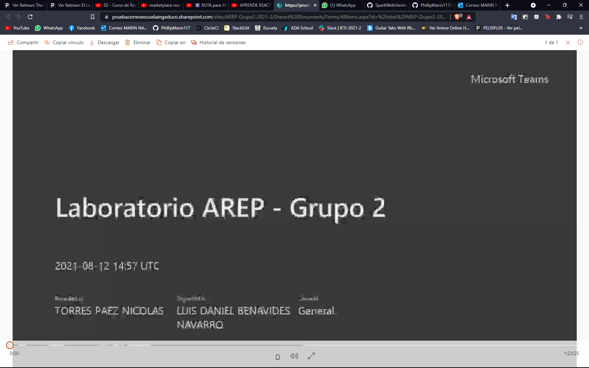

# Taller AREP-SparkWeb

## Descripcion:

 Este es el primer taller de AREP para familiarizarnos mas con el despliegue en Heroku y el framewok SparkWeb
 En el siguiente enlace podremos encontrar el video de como el profesor despliega la app:
 **[Video Explicación: ](https://pruebacorreoescuelaingeduco.sharepoint.com/sites/AREP-Grupo2-2021-2/Shared%20Documents/Forms/AllItems.aspx?id=%2Fsites%2FAREP%2DGrupo2%2D2021%2D2%2FShared%20Documents%2FGeneral%2FRecordings%2FLaboratorio%20AREP%20%2D%20Grupo%202%2D20210812%5F095703%2DGrabaci%C3%B3n%20de%20la%20reuni%C3%B3n%2Emp4&parent=%2Fsites%2FAREP%2DGrupo2%2D2021%2D2%2FShared%20Documents%2FGeneral%2FRecordings)**
 
 A partir del minuto 35:11 empieza la explicacion para desplegar de manera correcta y efectiva en Heroku
 
## Construido con

* [Maven](https://maven.apache.org/) - Dependency Management
* [Java](https://www.java.com/es/download/) - Lenguaje de programación
* [Spark ](https://sparkjava.com/)  - Framework
* [Heroku ](https://spring.io/quickstart) - Despliegue Web
* [Git](https://github.com/) - Versionamiento

## Authors

 **Felipe Marín**
 **Luis Daniel Benavides (Profesor)**

## Enlaces:
App despliegada en Heroku : **[SparkWebApp](https://spark-web-heroku-app.herokuapp.com/)**

## Licencia

This project is licensed under the MIT License - see the [LICENSE.md](LICENSE.md) file for details
